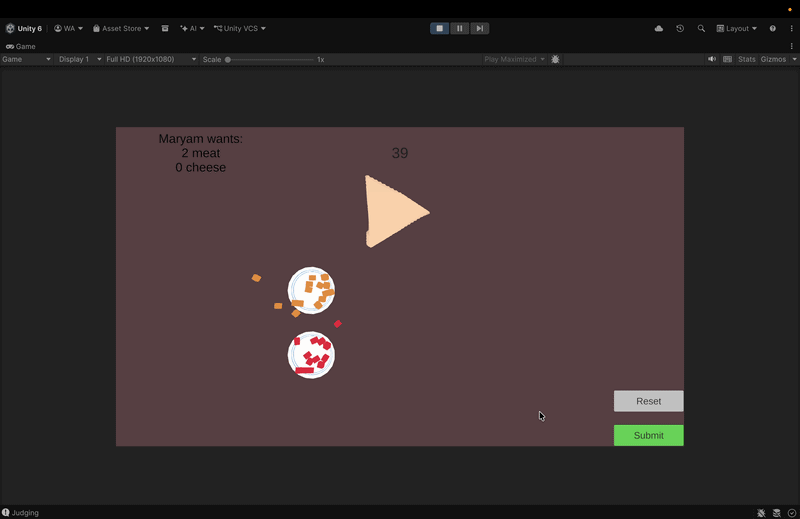

# Sambosa Shop

A timed mobile prototype that transforms paper-folding mechanics into a samosa-making game.
The player folds dough, fills it with meat or cheese, and serves customers before time runs out.

## Gameplay

[Watch the full demo →](https://youtu.be/qET629fssZ4)

## Setup

**Requirements**
- Unity 6.4 (6000.4.7f1) or later
- Universal Render Pipeline

**Run**
1. Clone this repository.
2. Open the project folder in Unity Hub.
3. Open `Assets/Scenes/gameScene.unity`.
4. Press Play.

## How to Play

- **Fold the dough**: click and drag from an edge of the dough.
- **Pick up filling**: hold the mouse button on a meat or cheese piece, move it over the dough, release to drop.
- **Submit**: when your samosa matches the order, click the Submit button.
- The game lasts 60 seconds. Serve as many customers as you can.

## Architecture

The project uses focused single-responsibility scripts that communicate through events and a central state machine. Core scripts include `SambosaMesh` (procedural fold math), `FoldInputHandler` and `FillingInputHandler` (player input), `OrderManager` (game loop and scoring), and a `GameStateMachine` singleton with event-based transitions.

For full design rationale and key engineering decisions, see [the technical documentation](docs/Sambosa-Shop-Technical-Documentation.pdf).

## Tech Stack

- Unity 6.4 (URP)
- C# with Unity's new Input System
- TextMeshPro for UI
- ScriptableObjects for order data
